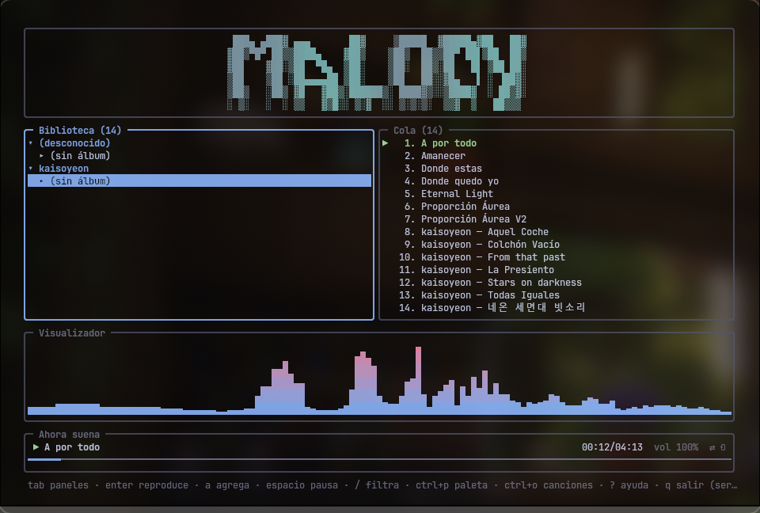
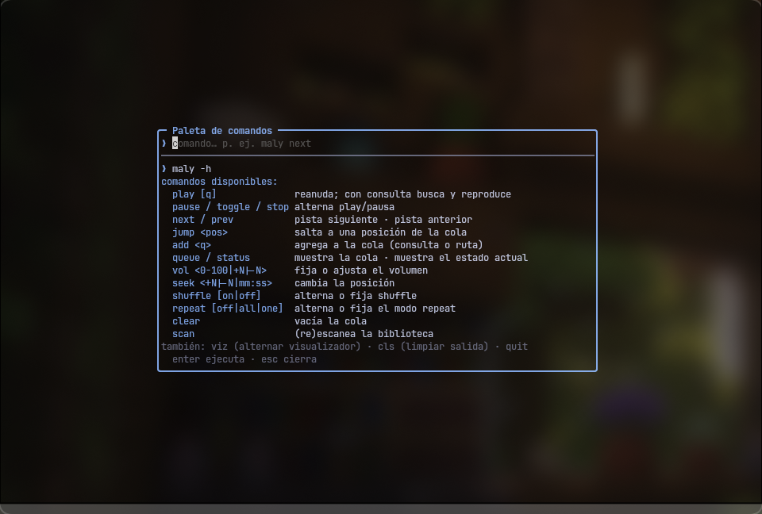
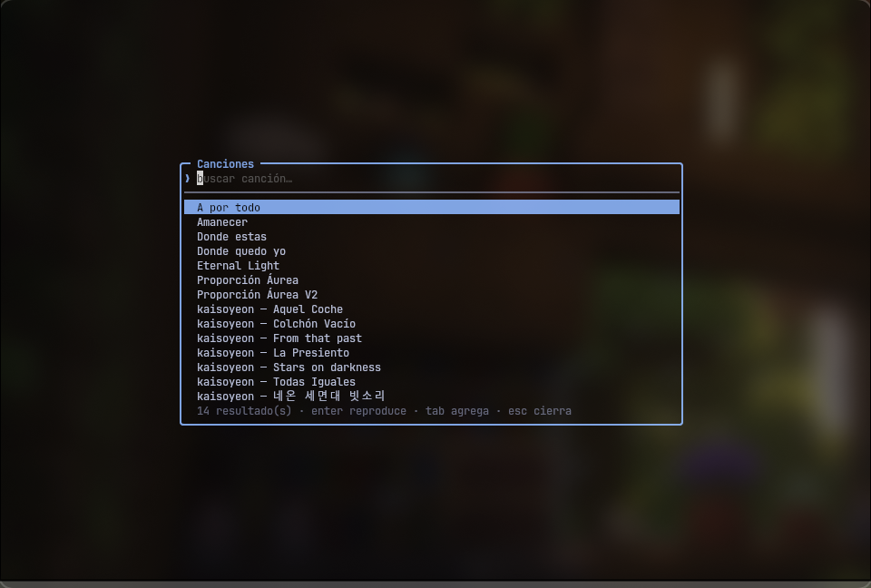
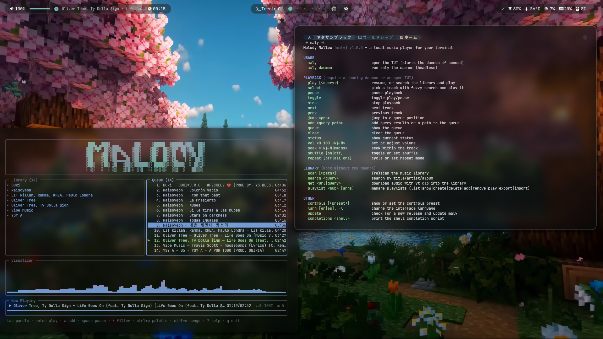

# Malody Mallow


🇪🇸 [Español](README.md) · 🇬🇧 [English](README.en.md)

A local terminal music player (command `maly`), in the style of
btop/lazygit: a TUI with panels, a background service over a Unix socket,
and an `mpc`/`playerctl`-style CLI, all in a single binary.

---

## TUI









---

## Features

- **mpv backend**: MP3, FLAC, OGG, OPUS, M4A, WAV effortlessly.
- **Gapless**: the next track in the queue is queued ahead in mpv and the
  switch happens without cutting the audio — also works with repeat one,
  with shuffle, and when skipping corrupted files.
- **Service + client**: music keeps playing even if you close the TUI (if
  you launched `maly daemon` separately). Control it from any terminal.
- **The session persists**: queue, volume, shuffle/repeat, and the current
  track with its position are restored when the service restarts — paused,
  ready to resume with `maly play`.
- **MPRIS**: the service announces itself as `org.mpris.MediaPlayer2.maly`
  on D-Bus — `playerctl`, Waybar's `mpris` module, and the desktop's media
  keys see and control it with zero configuration; the track's embedded
  cover art is published as `mpris:artUrl`.
- **SQLite library**: tag scanning (artist/album/title/year/genre),
  accent- and case-insensitive search ("aurea" finds "Áurea").
- **Spectrum visualizer**: live FFT off the PipeWire/PulseAudio monitor,
  with a color gradient; bars follow smoothed amplitude (CAVA-style).
- **Ctrl+P palette**: an integrated command console (`maly next`, `vol +5`,
  `status`…) with output shown right inside the palette.
- **Ctrl+O selector / `maly select`**: fuzzy search across the whole
  library (`enter` plays, `tab` adds to the queue); from the CLI it opens
  as a mini modal without loading the full TUI.
- **Ctrl+L playlist panel**: manage your playlists without leaving the TUI
  (`enter` plays, `tab` queues, `ctrl+n` creates, `ctrl+x` deletes), and
  with `A` you send the library or queue selection to a playlist.
  Playlists also hang off the Library tree, with their tracks numbered:
  `enter` expands them and `a` queues them like any other node.
- **Vim navigation**: `h j k l`, `gg`, `G`, `ctrl+d`/`ctrl+u` across panels
  (arrow keys still work), and control presets via `maly controls`
  (`default` | `vim`).
- **Bilingual**: English/Spanish interface; chosen on first launch
  (`language` config key).
- **Dynamic shell completion** (bash/fish/zsh): TAB completes commands,
  real titles from your library, playlists, and queue positions (see
  [Completion](#completion-bash--fish--zsh)).
- **Playlists** with M3U export/import, shuffle, repeat (off/all/one), live queue.
- **`maly get`**: downloads audio with yt-dlp directly into your library
  (`maly get "artist song"` or a URL) — with embedded metadata and cover
  art, and automatic re-scan. yt-dlp and ffmpeg are optional: only this
  command uses them.
- **Theme and keybindings** configurable via TOML; transparent background (uses your terminal's color).

## Installation

### Quick: Mallow Install (any distro)

```sh
curl -fsSL https://raw.githubusercontent.com/kitasael-burakku/Malody-Mallow/main/mallow-install.sh | sh
```

The installer is interactive, screen by screen: you choose the action
(install, update, or uninstall), the scope (user or system), and which
dependencies to install from a checklist — `mpv` and `git` come checked;
`yt-dlp`+`ffmpeg` (for `maly get`) and the visualizer are optional and
start unchecked. It detects your package manager (pacman, apt, dnf,
zypper, xbps); on Debian/Ubuntu `yt-dlp` is installed via `pipx` because
the repo's version is old and no longer downloads from YouTube. If your
distro's Go doesn't meet the minimum, it offers to download the official
toolchain from go.dev (verified with its SHA-256) to `~/.cache/mallow` —
only for building, without touching the system. It builds from `main`,
installs to `~/.local/bin`, and leaves your shell's completions in place.
Nothing gets installed without asking; without a terminal it runs entirely
with the defaults.

- `--install` / `--update` / `--uninstall` skip the action menu
  (`--update` shows the version jump; `--uninstall` offers to also delete
  config and library — kept by default).
- `--system` installs to `/usr/local` for all users (asks for sudo).
- Re-running it updates to the latest `main`.
- Also works from a checkout: `./mallow-install.sh`.

With maly already installed, `maly update` does all of this on its own: it
checks the repo's tags via git, and if there's a new release it downloads
the installer and runs it with `--update`. The TUI warns in the footer
when a new version is available (checked on open, at most once a day;
disabled with `update_check = false` in the config).

### By hand

System dependencies: `mpv` (audio), Go ≥ 1.25 (to build), and, for the
visualizer, PipeWire or PulseAudio with their command-line tools.
Optional: `yt-dlp` and `ffmpeg`, only if you want to download music with
`maly get`.

**Arch Linux**

```sh
sudo pacman -S mpv pipewire pipewire-pulse go   # pw-record comes with pipewire
```

**Ubuntu / Debian**

```sh
sudo apt install mpv pipewire git   # or: pulseaudio-utils instead of pipewire
sudo snap install go --classic      # apt's golang-go is old (1.22 on Ubuntu 24.04)
```

On Debian (without snap) install Go from <https://go.dev/dl/>: apt's
`golang-go` doesn't reach 1.25 and the package disables automatic
toolchain downloads, so `go build` fails with
`go.mod requires go >= 1.25.0`.

**Fedora**

```sh
sudo dnf install mpv pipewire-utils golang git   # mpv without RPM Fusion; pw-record comes in pipewire-utils
```

> Since Fedora 43 the `golang` package also sets `GOTOOLCHAIN=local` (it
> won't automatically download another toolchain), same as Debian. Right
> now this doesn't affect anything because Fedora 43/44 already ships Go
> 1.25/1.26, but if this project raises its minimum Go version in the
> future and `go build` fails with `toolchain not available`, install the
> new version from <https://go.dev/dl/>.

**openSUSE**

```sh
sudo zypper install mpv pipewire pipewire-tools go git
```

On Tumbleweed `go` is already ≥ 1.25; on Leap it may be older — if
`go version` doesn't meet it, install from <https://go.dev/dl/>.

**Void Linux**

```sh
sudo xbps-install -S mpv pipewire go git
```

**Clone and build**

```sh
git clone https://github.com/kitasael-burakku/Malody-Mallow.git
cd Malody-Mallow
go build -o maly ./cmd/maly
install -Dm755 maly ~/.local/bin/maly
```

If after this you get `maly: command not found`: on Ubuntu/Debian a clean
install doesn't ship `~/.local/bin`, and `~/.profile` only adds it to PATH
if the folder already existed at login — the `install` step worked, but
your current shell doesn't see it. Reload your profile
(`source ~/.profile`) or open a new session. An alternative that doesn't
depend on the user's PATH: `sudo install -Dm755 maly /usr/local/bin/maly`.

Without `pw-record`/`parec` maly works the same; the visualizer degrades
to an animation and warns you once.

### Completion (bash / fish / zsh)

`maly completions <shell>` prints the script; install it once and TAB
will complete commands with their description, real titles from your
library (accent-insensitive search), playlists, queue positions, and
paths.

**fish**

```sh
maly completions fish > ~/.config/fish/completions/maly.fish
```

**bash** (requires the `bash-completion` package, already present on
Ubuntu/Debian/Fedora; on Arch: `sudo pacman -S bash-completion`)

```sh
mkdir -p ~/.local/share/bash-completion/completions
maly completions bash > ~/.local/share/bash-completion/completions/maly
```

Without `bash-completion`, add to `~/.bashrc`: `source <(maly completions bash)`.

In bash the first TAB inserts whatever can be decided (a single candidate
or the common prefix, e.g. `aurea` → `Proporción\ Áurea`); when there are
several options, the second TAB shows the list with descriptions.

**zsh**

```sh
mkdir -p ~/.local/share/zsh/site-functions
maly completions zsh > ~/.local/share/zsh/site-functions/_maly
```

and in `~/.zshrc`, **before** `compinit`:

```sh
fpath=(~/.local/share/zsh/site-functions $fpath)
```

Alternative without touching fpath: `source <(maly completions zsh)`
after `compinit`.

Open a new shell session and you're set. Completion queries the library
on every TAB (new titles show up without reinstalling anything) and
degrades silently: without a library or without the service it simply
offers no candidates.

## Usage

```sh
maly scan            # indexes ~/Music (or config's music_dir) into SQLite
maly                 # opens the TUI; starts the embedded service if none is running
```

The first time, `~/.config/maly/config.toml` is created with the
defaults.

### TUI

| Key | Action |
|---|---|
| `space` | play / pause |
| `n` / `p` | next / previous |
| `+` / `-` | volume ±5% |
| `←` / `→` | seek ±5s |
| `tab` | switch panel |
| `enter` | play track / expand node |
| `a` | add to queue (track, album, or artist) |
| `d` | remove from queue |
| `/` | filter the current panel |
| `h j k l` | vim navigation (`h`/`l` collapse/expand in the library) |
| `gg` / `G` | go to start / end of the list |
| `ctrl+d` / `ctrl+u` | half page down / up |
| `s` / `r` | shuffle / repeat |
| `v` | toggle visualizer |
| `ctrl+p` | command palette (integrated console) |
| `ctrl+o` | song selector (fuzzy; `enter` plays, `tab` adds) |
| `ctrl+l` | playlist panel (`enter` plays, `tab` queues, `ctrl+n` creates, `ctrl+x` deletes) |
| `A` | add the selection (track, album, or artist) to a playlist |
| `?` | help |
| `q` | quit |

All remappable in the config's `[keys]`. `maly controls vim` activates
the vim preset (`x` removes from queue, `<`/`>` previous/next); whatever's
written in `[keys]` always wins over the preset.

### CLI (mpc-style)

```sh
maly daemon                    # service without TUI (headless)
maly play [query]              # plays; with a query, searches the library
maly select                    # mini fuzzy selector: enter plays, tab adds
maly pause | toggle | stop
maly next | prev
maly jump <pos>                # jumps to that queue position (see maly queue)
maly add <query|path>          # adds to the queue (accepts files and folders)
maly queue                     # shows the queue
maly clear                     # empties the queue
maly status                    # what's playing, position, volume, modes
maly vol 80 | vol +5 | vol -5
maly seek +10 | seek -10 | seek 1:30
maly shuffle [on|off]
maly repeat [off|all|one]
maly search <query>            # searches the library (works without the daemon)
maly scan [path]                # (re)scans (works without the daemon)
maly get <url|search>          # downloads audio into the library (requires yt-dlp and ffmpeg)
maly playlist list
maly playlist show <name>                 # lists tracks with their position
maly playlist create <name>
maly playlist add <name> <query>
maly playlist remove <name> <position>    # removes the track at that position
maly playlist play <name>
maly playlist delete <name>
maly playlist export <name> [file]        # writes the playlist as M3U
maly playlist import <file> [name]        # creates a playlist from an M3U
maly controls [default|vim]    # lists or changes the controls preset
maly lang [en|es]              # changes the language (no arg opens the selector); alias -l
maly update                    # checks for a new release and runs the installer
maly completions <shell>       # completion script (bash | fish | zsh)
maly version | -v              # also shows the running service's version, if any
```

Library commands (`scan`, `search`, `get`, and all of `playlist` except
`play`) operate directly on SQLite and don't need the service. Playback
commands do: open it with `maly` or `maly daemon`. If the service is
running, `scan` (and `get`'s re-scan) goes through it, and any open TUI
reloads its library instantly, with nothing to touch.

`maly get` delegates all web interaction to yt-dlp (like lazygit uses
git): without `://` it searches the phrase on YouTube and downloads the
first result; with a URL it downloads it as-is. The audio ends up as an
MP3 with embedded metadata and cover art in `music_dir`, and the library
re-scans itself (through the service, if it's running).

### Hyprland

You can add maly to your Hyprland config in Lua. Daemon autostart:

```lua
hl.exec_cmd("maly daemon &") -- add to the autostart module
```

Toggle for a dedicated terminal (opens/closes a kitty window with the
TUI, filtering by client so it doesn't kill the autostart daemon):

```lua
-- Programs
music = "hyprctl clients | grep -i 'title: maly' >/dev/null && pkill -f 'kitty --title maly' || kitty --title maly -e maly"
```

```lua
-- Keybinds
hl.bind(mainMod .. "+ M", hl.dsp.exec_cmd(Programs.music))
```

> Tip: when using `kitty --title maly` in the toggle, always filter by
> client via `hyprctl` before the `pkill -f`; without that filter,
> `pkill -f` can reach the very process that invoked it and kill the
> autostart daemon instead of just the kitty window.

### MPRIS (playerctl, Waybar…)

While the service is running (TUI open or `maly daemon`), maly is just
another MPRIS2 player on the desktop:

```sh
playerctl -p maly play-pause
playerctl -p maly next
playerctl -p maly metadata --format '{{artist}} — {{title}}'
playerctl -p maly position 30      # jumps to second 30
```

For "now playing" in Waybar, the native `mpris` module is enough:

```jsonc
"mpris": {
    "player": "maly",     // omit it to follow any player
    "format": "{status_icon} {artist} — {title}",
    "status-icons": { "playing": "▶", "paused": "⏸" }
}
```

Track/state changes are emitted as D-Bus signals (`PropertiesChanged`),
so applets update instantly with no polling. If there's no session bus
(e.g. headless), maly warns once and keeps working without MPRIS.

## Configuration

`~/.config/maly/config.toml` (generated with these defaults):

```toml
music_dir = "~/Music"
language = ""             # "" = ask on TUI open; "en" | "es"
controls = "default"      # key scheme: default | vim (maly controls)
update_check = true       # the TUI warns if a new version is out (maly update)

[theme]
transparent = true        # no background; use the terminal's
accent = "#89b4fa"
border = "#45475a"
text = "#cdd6f4"
dim = "#6c7086"
playing = "#a6e3a1"

[visualizer]
enabled = true
color_low = "#89b4fa"     # color at the base of the bars
color_high = "#f38ba8"    # color at the tips
bars_gravity = 0.92       # 0-1: how long bars take to fall

[keys]
# play_pause = " "
# next = "n"
# prev = "p"
# vol_up = "+"
# vol_down = "-"
# seek_forward = "right"
# seek_back = "left"
# switch_panel = "tab"
# filter = "/"
# add = "a"
# remove = "d"
# shuffle = "s"
# repeat = "r"
# quit = "q"
# help = "?"
# palette = "ctrl+p"
# songs = "ctrl+o"
# playlists = "ctrl+l"
# playlist_add = "A"
# toggle_viz = "v"
```

## Architecture

- `maly` (no args) opens the TUI; if there's no service, it embeds one
  (dies when the TUI exits).
- `maly daemon` leaves it running separately; the TUI and CLI connect to
  it.
- Socket: `$XDG_RUNTIME_DIR/maly/maly.sock`, a single-line JSON protocol;
  the TUI subscribes to changes via push (no polling) and detects if the
  service is running a different binary version.
- MPRIS: the service exports `org.mpris.MediaPlayer2.maly` on the session
  bus (`internal/mpris`, godbus); it only reflects the daemon's state,
  playback logic isn't duplicated.
- Database: `~/.local/share/maly/library.db` (pure-Go SQLite, no CGo).
- maly launches and supervises its own `mpv --idle --no-video` and
  controls it via JSON IPC; when maly closes, its mpv dies with it.

## License

[MIT](LICENSE).
