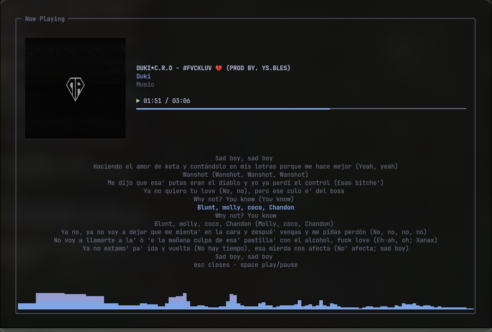

# Malody Mallow


🇪🇸 [Español](README.md) · 🇬🇧 [English](README.en.md)

**Malody Mallow** (`maly`) es un reproductor de música local que vive en
tu terminal, al estilo de btop y lazygit: una TUI con paneles, carátulas,
letras sincronizadas y visualizador de espectro; un servicio en segundo
plano que sigue sonando cuando cierras la ventana; y una CLI tipo
`mpc`/`playerctl` para manejarlo desde cualquier terminal — o desde el
escritorio, vía MPRIS. Todo en un solo binario escrito en Go.

---

## Capturas




---

## Características

- **Backend mpv**: MP3, FLAC, OGG, OPUS, M4A, WAV sin esfuerzo.
- **Gapless**: la siguiente pista de la cola se anexa a mpv por adelantado
  y el cambio ocurre sin cortar el audio — también con repeat one, con
  shuffle y al saltar archivos dañados.
- **Servicio + cliente**: la música sigue sonando aunque cierres la TUI
  (si lanzaste `maly daemon` aparte). Control desde cualquier terminal.
- **La sesión sobrevive**: cola, volumen, shuffle/repeat y la pista actual
  con su posición se restauran al reiniciar el servicio — en pausa, listos
  para reanudar con `maly play`.
- **MPRIS**: el servicio se anuncia como `org.mpris.MediaPlayer2.maly` en
  D-Bus — `playerctl`, el módulo `mpris` de Waybar y las teclas multimedia
  del escritorio lo ven y controlan sin configurar nada; la carátula
  embebida de la pista se publica como `mpris:artUrl`.
- **Biblioteca SQLite**: escaneo de tags (artista/álbum/título/año/género),
  búsqueda insensible a acentos y mayúsculas ("aurea" encuentra "Áurea").
- **Visualizador de espectro**: FFT en vivo del monitor de
  PipeWire/PulseAudio, con gradiente de color; las barras siguen la
  amplitud suavizada (estilo CAVA).
- **Pantalla "Ahora suena" (Ctrl+T)**: vista a pantalla completa con la
  carátula embebida renderizada en el terminal, letras sincronizadas con
  la reproducción (sidecar `.lrc`, o embebidas en la pista) y la franja
  del visualizador. En kitty la carátula se dibuja como imagen real (su
  protocolo gráfico, detectado solo); en cualquier otro terminal
  truecolor sale en half-blocks.
- **Paleta Ctrl+P**: consola integrada de comandos (`maly next`, `vol +5`,
  `status`…) con la salida dentro de la propia paleta.
- **Selector Ctrl+O / `maly select`**: búsqueda difusa sobre toda la
  biblioteca (`enter` reproduce, `tab` agrega a la cola); desde la CLI se
  abre como mini modal sin cargar la TUI completa.
- **Panel de playlists Ctrl+L**: gestiona tus playlists sin salir de la
  TUI (`enter` reproduce, `tab` encola, `ctrl+n` crea, `ctrl+x` borra), y
  con `A` mandas la selección de la biblioteca o la cola a una playlist.
  Las playlists también cuelgan del árbol de la Biblioteca, con sus pistas
  numeradas: `enter` las expande y `a` las encola como cualquier nodo.
- **Navegación vim**: `h j k l`, `gg`, `G`, `ctrl+d`/`ctrl+u` en los
  paneles (las flechas siguen funcionando), y presets de controles con
  `maly controls` (`default` | `vim`).
- **Bilingüe**: interfaz en English/Español; se elige al primer arranque
  (clave `language` del config).
- **Autocompletado de shell** (bash/fish/zsh) dinámico: TAB completa
  comandos, títulos reales de tu biblioteca, playlists y posiciones de la
  cola (ver [Autocompletado](#autocompletado-bash--fish--zsh)).
- **Playlists** con export/import M3U, shuffle, repeat (off/all/one), cola en vivo.
- **`maly get`**: descarga audio con yt-dlp directo a tu biblioteca
  (`maly get "artista canción"` o una URL) — con metadata y carátula
  embebidas, y re-escaneo automático. yt-dlp y ffmpeg son opcionales:
  solo este comando los usa.
- **Tema y keybindings** configurables por TOML: fondo transparente (usa
  el color de tu terminal), colores del banner en vivo (comando `logo` de
  la paleta) y arte ASCII propio vía `logo.txt`.

## Instalación

### Rápida: Mallow Install (cualquier distro)

```sh
curl -fsSL https://raw.githubusercontent.com/kitasael-burakku/Malody-Mallow/main/mallow-install.sh | sh
```

El instalador es un wizard interactivo con el banner MALODY en degradado:
eliges la acción (instalar, actualizar o desinstalar), el ámbito (usuario o
sistema) y qué dependencias instalar en un checklist, navegando con
`↑↓`/`jk` y marcando con espacio (si el terminal no da modo crudo, cae al
modo numérico de siempre) — `mpv` y `git` vienen marcados; `yt-dlp`+`ffmpeg`
(para `maly get`) y el visualizador son opcionales y arrancan desmarcados.
Los pasos largos (clonar, compilar) laten con un spinner y el tiempo
transcurrido.
Detecta tu gestor de paquetes (pacman, apt, dnf, zypper, xbps); en
Debian/Ubuntu `yt-dlp` se instala vía `pipx` porque el del repo es viejo y
ya no descarga de YouTube. Si el Go de tu distro no llega al mínimo, ofrece
bajar el toolchain oficial de go.dev (verificado con su SHA-256) a
`~/.cache/mallow` — solo para compilar, sin tocar el sistema. Compila desde
`main`, instala en `~/.local/bin` y deja las completions de tu shell. Nada
se instala sin preguntar; sin terminal corre entero con los defaults.

- `--install` / `--update` / `--uninstall` saltan el menú de acción
  (`--update` muestra el salto de versión; `--uninstall` ofrece borrar
  también config y biblioteca — por defecto quedan).
- `--system` instala en `/usr/local` para todos los usuarios (pide sudo).
- Re-ejecutarlo actualiza a lo último de `main`.
- Desde un checkout también funciona: `./mallow-install.sh`.

Con maly ya instalado, `maly update` hace todo esto solo: consulta los tags
del repo con git, y si hay un release nuevo descarga el instalador y lo corre
con `--update`. La TUI avisa en el pie cuando hay versión nueva (chequeo al
abrir, uno por día como mucho; se apaga con `update_check = false` en el
config).

### A mano

Dependencias de sistema: `mpv` (audio), Go ≥ 1.25 (para compilar) y, para
el visualizador, PipeWire o PulseAudio con sus herramientas de línea de
comandos. Opcionales: `yt-dlp` y `ffmpeg`, solo si quieres descargar
música con `maly get`.

**Arch Linux**

```sh
sudo pacman -S mpv pipewire pipewire-pulse go   # pw-record viene con pipewire
```

**Ubuntu / Debian**

```sh
sudo apt install mpv pipewire git   # o: pulseaudio-utils en vez de pipewire
sudo snap install go --classic      # el golang-go de apt es viejo (1.22 en Ubuntu 24.04)
```

En Debian (sin snap) instala Go desde <https://go.dev/dl/>: el `golang-go`
de apt no llega a 1.25 y el paquete desactiva la descarga automática de
toolchains, así que `go build` falla con `go.mod requires go >= 1.25.0`.

**Fedora**

```sh
sudo dnf install mpv pipewire-utils golang git   # mpv sin RPM Fusion; pw-record viene en pipewire-utils
```

> Desde Fedora 43 el paquete `golang` también fija `GOTOOLCHAIN=local` (no
> descarga otro toolchain automáticamente), igual que Debian. Ahora mismo no
> afecta porque Fedora 43/44 ya trae Go 1.25/1.26, pero si en el futuro este
> proyecto sube el mínimo de Go y `go build` falla con
> `toolchain not available`, instala la versión nueva desde
> <https://go.dev/dl/>.

**openSUSE**

```sh
sudo zypper install mpv pipewire pipewire-tools go git
```

En Tumbleweed `go` ya es ≥ 1.25; en Leap puede ser más viejo — si
`go version` no llega, instala desde <https://go.dev/dl/>.

**Void Linux**

```sh
sudo xbps-install -S mpv pipewire go git
```

**Clonar y compilar**

```sh
git clone https://github.com/kitasael-burakku/Malody-Mallow.git
cd Malody-Mallow
go build -o maly ./cmd/maly
install -Dm755 maly ~/.local/bin/maly
```

Si después de esto sale `maly: command not found`: en Ubuntu/Debian una
instalación limpia no trae `~/.local/bin`, y `~/.profile` solo lo agrega
al PATH si la carpeta ya existía al iniciar sesión — el `install` funciona,
pero tu shell actual no la ve. Recarga el perfil (`source ~/.profile`) o
abre una sesión nueva. Alternativa que no depende del PATH del usuario:
`sudo install -Dm755 maly /usr/local/bin/maly`.

Sin `pw-record`/`parec` maly funciona igual; el visualizador degrada a una
animación y te lo avisa una vez.

### Autocompletado (bash / fish / zsh)

`maly completions <shell>` imprime el script; instálalo una vez y el TAB
completa comandos con su descripción, títulos de tu biblioteca (búsqueda
insensible a acentos), playlists, posiciones de la cola y rutas.

**fish**

```sh
maly completions fish > ~/.config/fish/completions/maly.fish
```

**bash** (requiere el paquete `bash-completion`, ya presente en
Ubuntu/Debian/Fedora; en Arch: `sudo pacman -S bash-completion`)

```sh
mkdir -p ~/.local/share/bash-completion/completions
maly completions bash > ~/.local/share/bash-completion/completions/maly
```

Sin `bash-completion`, agrega a `~/.bashrc`: `source <(maly completions bash)`.

En bash el primer TAB inserta lo que se pueda decidir (candidato único o el
prefijo común, p. ej. `aurea` → `Proporción\ Áurea`); cuando hay varias
opciones, el segundo TAB muestra la lista con descripciones.

**zsh**

```sh
mkdir -p ~/.local/share/zsh/site-functions
maly completions zsh > ~/.local/share/zsh/site-functions/_maly
```

y en `~/.zshrc`, **antes** del `compinit`:

```sh
fpath=(~/.local/share/zsh/site-functions $fpath)
```

Alternativa sin tocar el fpath: `source <(maly completions zsh)` después
del `compinit`.

Abre una sesión nueva del shell y listo. El completado consulta la
biblioteca en cada TAB (los títulos nuevos aparecen sin reinstalar nada) y
degrada en silencio: sin biblioteca o sin servicio simplemente no ofrece
candidatos.

## Uso

```sh
maly scan            # indexa ~/Music (o music_dir del config) en SQLite
maly                 # abre la TUI; inicia el servicio integrado si no hay uno
```

La primera vez se crea `~/.config/maly/config.toml` con los defaults.

### TUI

| Tecla | Acción |
|---|---|
| `espacio` | reproducir / pausar |
| `n` / `p` | siguiente / anterior |
| `+` / `-` | volumen ±5% |
| `←` / `→` | seek ±5s |
| `tab` | cambiar de panel |
| `enter` | reproducir pista / expandir nodo |
| `a` | agregar a la cola (pista, álbum o artista) |
| `d` | quitar de la cola |
| `/` | filtrar el panel actual |
| `h j k l` | navegación vim (`h`/`l` pliega/expande en la biblioteca) |
| `gg` / `G` | inicio / final de la lista |
| `ctrl+d` / `ctrl+u` | media página abajo / arriba |
| `s` / `r` | shuffle / repeat |
| `v` | alternar visualizador |
| `ctrl+t` | pantalla "Ahora suena" (carátula y letras) |
| `ctrl+p` | paleta de comandos (consola integrada) |
| `ctrl+o` | selector de canciones (fuzzy; `enter` reproduce, `tab` agrega) |
| `ctrl+l` | panel de playlists (`enter` reproduce, `tab` encola, `ctrl+n` crea, `ctrl+x` borra) |
| `A` | agregar la selección (pista, álbum o artista) a una playlist |
| `?` | ayuda |
| `q` | salir |

Todas remapeables en `[keys]` del config. Con `maly controls vim` se activa
el preset vim (`x` quita de la cola, `<`/`>` anterior/siguiente); lo escrito
en `[keys]` siempre gana sobre el preset.

### CLI (estilo mpc)

```sh
maly daemon                    # servicio sin TUI (headless)
maly kill                      # apaga el servicio, esté donde esté
maly play [consulta]           # reproduce; con consulta busca en la biblioteca
maly select                    # mini selector fuzzy: enter reproduce, tab agrega
maly pause | toggle | stop
maly next | prev
maly jump <pos>                # salta a esa posición de la cola (ver maly queue)
maly add <consulta|ruta>       # agrega a la cola (acepta archivos y carpetas)
maly queue                     # muestra la cola
maly clear                     # vacía la cola
maly status                    # qué suena, posición, volumen, modos
maly vol 80 | vol +5 | vol -5
maly seek +10 | seek -10 | seek 1:30
maly shuffle [on|off]
maly repeat [off|all|one]
maly search <consulta>         # busca en la biblioteca (funciona sin demonio)
maly scan [ruta]               # (re)escanea (funciona sin demonio)
maly get <url|búsqueda>        # descarga audio a la biblioteca (requiere yt-dlp y ffmpeg)
maly playlist list
maly playlist show <nombre>               # lista las pistas con su posición
maly playlist create <nombre>
maly playlist add <nombre> <consulta>
maly playlist remove <nombre> <posición>  # quita la pista en esa posición
maly playlist play <nombre>
maly playlist delete <nombre>
maly playlist export <nombre> [archivo]   # escribe la playlist como M3U
maly playlist import <archivo> [nombre]   # crea una playlist desde un M3U
maly controls [default|vim]    # lista o cambia el preset de controles
maly lang [en|es]              # cambia el idioma (sin arg abre el selector); alias -l
maly update                    # busca un release nuevo y corre el instalador
maly completions <shell>       # script de autocompletado (bash | fish | zsh)
maly version | -v              # también muestra la versión del servicio si corre
```

Los comandos de biblioteca (`scan`, `search`, `get` y todo `playlist` salvo
`play`) operan directo sobre SQLite y no necesitan el servicio. Los de
reproducción sí lo piden: ábrelo con `maly` o `maly daemon`. Si el servicio
está corriendo, `scan` (y el re-escaneo de `get`) pasa a través de él y toda
TUI abierta recarga su biblioteca al instante, sin tocar nada.

`maly get` delega toda la interacción web en yt-dlp (como lazygit usa git):
sin `://` busca la frase en YouTube y baja el primer resultado; con una URL
la descarga tal cual. El audio queda como MP3 con metadata y carátula
embebidas en `music_dir`, y la biblioteca se re-escanea sola (a través del
servicio si está corriendo).

Para videos que piden cuenta (restricción de edad, etc), configura
`cookies_from_browser` en la sección `[ytdlp]` del config: el valor viaja
tal cual al `--cookies-from-browser` de yt-dlp — `firefox`, `chrome`,
`navegador:perfil`, o para navegadores derivados una ruta de perfil, p. ej.
Zen: `firefox:/home/tu-usuario/.config/zen/<perfil>`. Ojo: con navegadores
Chromium yt-dlp puede pedir desbloquear el keyring, y si la base de cookies
está bloqueada, cierra el navegador e intenta de nuevo.

### Hyprland

Puedes agregar maly a tu configuración de Hyprland en Lua. Autostart del
demonio:

```lua
hl.exec_cmd("maly daemon &") -- se agrega al módulo de autostart
```

Toggle de una terminal dedicada (abre/cierra una ventana de kitty con la
TUI, filtrando por cliente para no matar el daemon del autostart):

```lua
-- Programs
music = "hyprctl clients | grep -i 'title: maly' >/dev/null && pkill -f 'kitty --title maly' || kitty --title maly -e maly"
```

```lua
-- Keybinds
hl.bind(mainMod .. "+ M", hl.dsp.exec_cmd(Programs.music))
```

> Tip: al usar `kitty --title maly` en el toggle, filtra siempre por el
> cliente vía `hyprctl` antes del `pkill -f`; sin ese filtro, `pkill -f`
> puede alcanzar al propio proceso que lo invocó y matar el daemon del
> autostart en vez de solo la ventana de kitty.

### MPRIS (playerctl, Waybar…)

Mientras el servicio corre (TUI abierta o `maly daemon`), maly es un
reproductor MPRIS2 más del escritorio:

```sh
playerctl -p maly play-pause
playerctl -p maly next
playerctl -p maly metadata --format '{{artist}} — {{title}}'
playerctl -p maly position 30      # salta al segundo 30
```

Para "now playing" en Waybar basta el módulo nativo `mpris`:

```jsonc
"mpris": {
    "player": "maly",     // omítelo para seguir a cualquier reproductor
    "format": "{status_icon} {artist} — {title}",
    "status-icons": { "playing": "▶", "paused": "⏸" }
}
```

Los cambios de pista/estado se emiten como señales D-Bus
(`PropertiesChanged`), así que los applets se actualizan al instante sin
polling. Si no hay bus de sesión (p. ej. headless), maly lo avisa una vez
y sigue funcionando sin MPRIS.

## Configuración

`~/.config/maly/config.toml` (se genera con estos defaults):

```toml
music_dir = "~/Music"
language = ""             # "" = preguntar al abrir la TUI; "en" | "es"
controls = "default"      # esquema de teclas: default | vim (maly controls)
update_check = true       # la TUI avisa si hay versión nueva (maly update)

[theme]
transparent = true        # sin fondo; usar el del terminal
accent = "#89b4fa"
border = "#45475a"
text = "#cdd6f4"
dim = "#6c7086"
playing = "#a6e3a1"
logo = ["#7ab8b8", "#8098a8", "#b85c50"]  # paradas del gradiente del banner (2 o más)
# arte del banner: crea logo.txt junto a este archivo con tu propio ASCII

[visualizer]
enabled = true
color_low = "#89b4fa"     # color de la base de las barras
color_high = "#f38ba8"    # color de las puntas
bars_gravity = 0.92       # 0-1: cuánto tardan en caer las barras

[ytdlp]
# navegador del que leer cookies para descargas que piden cuenta
# (restricción de edad, etc); vacío = desactivado. Acepta navegador:perfil
# (p. ej. "firefox:default-release") — el valor va tal cual a yt-dlp
cookies_from_browser = ""

[keys]
# play_pause = " "
# next = "n"
# prev = "p"
# vol_up = "+"
# vol_down = "-"
# seek_forward = "right"
# seek_back = "left"
# switch_panel = "tab"
# filter = "/"
# add = "a"
# remove = "d"
# shuffle = "s"
# repeat = "r"
# quit = "q"
# help = "?"
# palette = "ctrl+p"
# songs = "ctrl+o"
# playlists = "ctrl+l"
# playlist_add = "A"
# toggle_viz = "v"
# now_playing = "ctrl+t"
```

## Arquitectura

- `maly` (sin args) abre la TUI; si no hay servicio, lo embebe (muere al salir).
- `maly daemon` lo deja corriendo aparte; la TUI y el CLI se conectan a él.
- Socket: `$XDG_RUNTIME_DIR/maly/maly.sock`, protocolo JSON de una línea;
  la TUI se suscribe a cambios por push (sin polling) y detecta si el
  servicio corre una versión distinta del binario.
- MPRIS: el servicio exporta `org.mpris.MediaPlayer2.maly` en el bus de
  sesión (`internal/mpris`, godbus); solo refleja el estado del demonio, la
  lógica de reproducción no se duplica.
- Base de datos: `~/.local/share/maly/library.db` (SQLite puro Go, sin CGo).
- maly lanza y supervisa su propio `mpv --idle --no-video` y lo controla por
  IPC JSON; al cerrar maly, su mpv muere con él.

## Licencia

[MIT](LICENSE).
