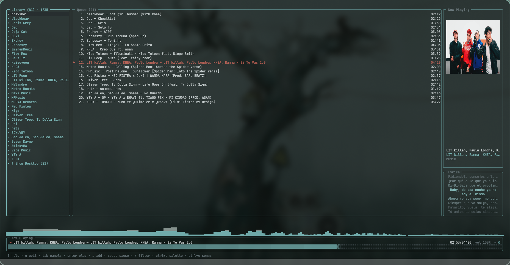
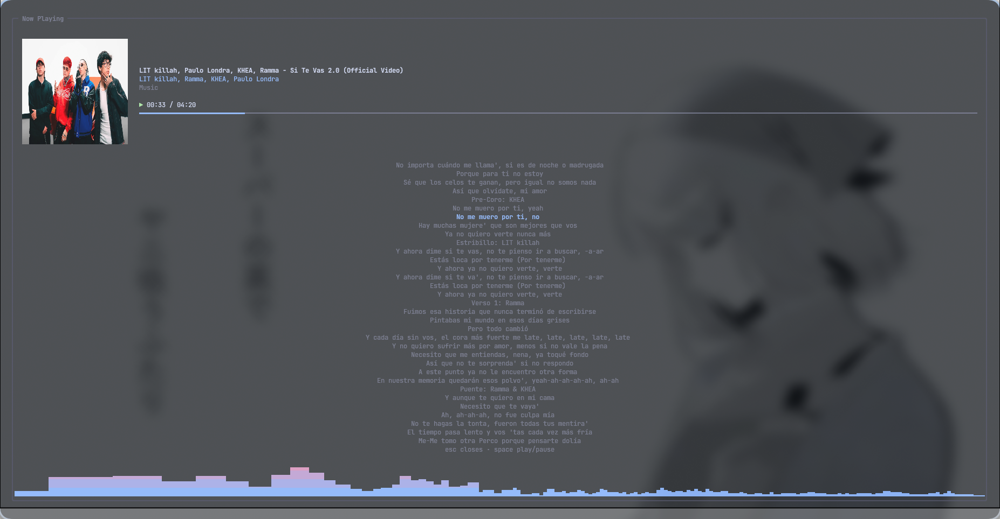
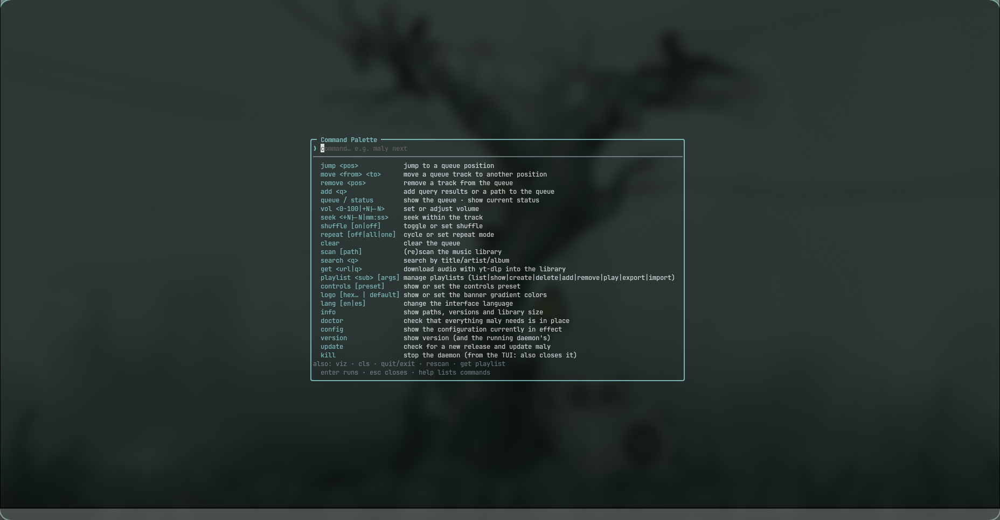
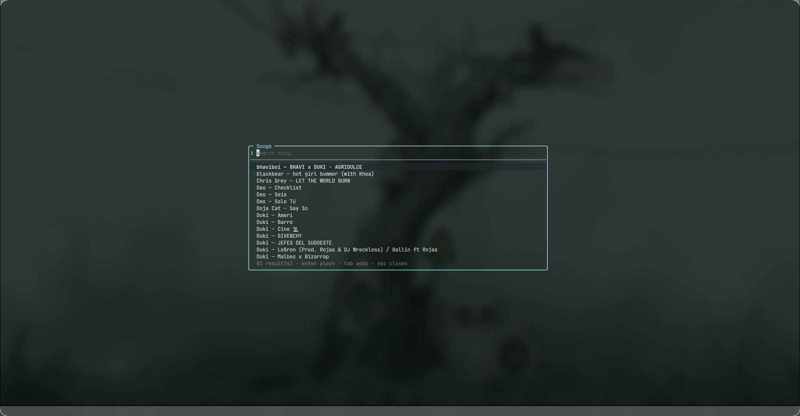
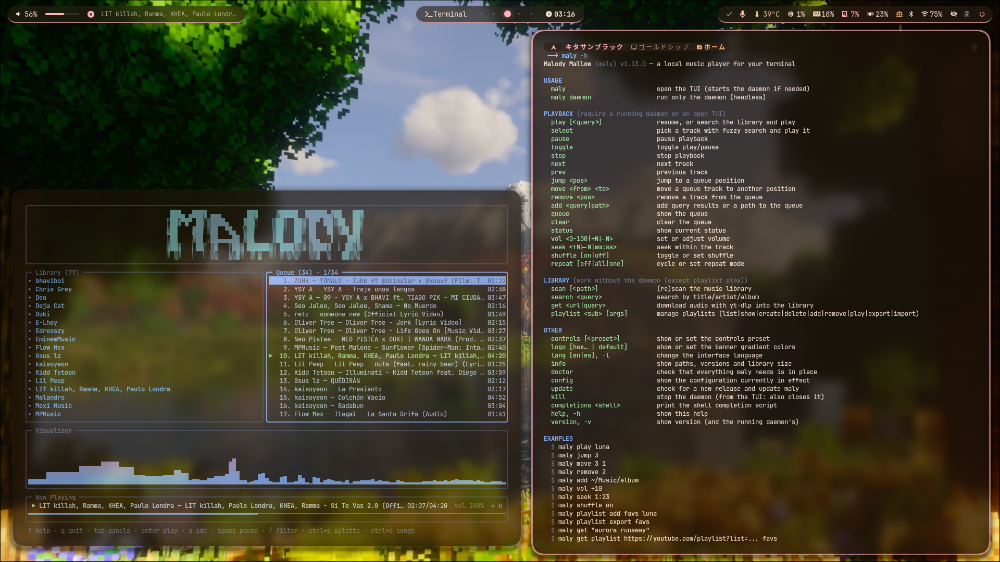

<div align="center">

# Malody Mallow

**Un reproductor de música local que vive en tu terminal, al estilo de btop y
lazygit.**

[](https://github.com/kitasael-burakku/Malody-Mallow/releases)
[](https://go.dev/dl/)
[](LICENSE)
[](https://github.com/kitasael-burakku/Malody-Mallow/actions/workflows/ci.yml)
[](https://aur.archlinux.org/packages/maly)
[](#requisitos-y-compatibilidad)

🇪🇸 [Español](README.md) · 🇬🇧 [English](README.en.md)



</div>

---

## Qué es Malody Mallow

**Malody Mallow** (`maly`) es un reproductor de música local para tu colección
en disco, pensado para vivir enteramente en la terminal. Todo en un solo
binario en Go, sin runtime ni dependencias de sistema salvo
[mpv](https://mpv.io/):

- Una **TUI** con paneles de biblioteca y cola, carátulas embebidas, letras
  sincronizadas y visualizador de espectro en vivo.
- Un **servicio en segundo plano** (`maly daemon`) que sigue sonando aunque
  cierres la ventana de la terminal, con sesión persistente.
- Una **CLI al estilo `mpc`/`playerctl`** para controlarlo desde cualquier
  terminal o script.
- Integración con el escritorio vía **MPRIS**: `playerctl`, el módulo `mpris`
  de Waybar y las teclas multimedia lo controlan sin configurar nada.

### Por qué usarlo

Si ya vives en la terminal y usas herramientas como btop o lazygit, Malody
Mallow encaja en ese mismo hábito: no hay que abrir una aplicación de
escritorio para poner música, y la reproducción no depende de que la ventana
siga abierta. La biblioteca es tuya —tus archivos, indexados en SQLite local,
sin cuenta ni streaming— y el reproductor habla los mismos protocolos que ya
usa el resto de tu escritorio Linux (MPRIS, D-Bus).

### En qué se diferencia

- **Gapless de verdad**, incluso con shuffle, repeat one o al saltar un
  archivo dañado — no es solo "sin pausas audibles", es la pista siguiente
  ya cargada en mpv antes de que la actual termine.
- **La sesión sobrevive**: cola, volumen, shuffle/repeat y posición de
  reproducción se restauran si reinicias el servicio.
- **Carátula como imagen real** en terminales con protocolo gráfico de kitty
  (detectado solo), con relleno automático en half-blocks en cualquier otro
  terminal truecolor.
- **Bilingüe de fábrica** (inglés/español), con autodetección del idioma del
  sistema en el primer arranque.
- **`maly get`**: baja audio con yt-dlp directo a tu biblioteca y la
  reindexa — la misma filosofía de lazygit de coordinar herramientas
  externas en vez de reimplementarlas. Con `ctrl+g` eliges entre los
  resultados desde la propia TUI, en vez de bajar el primero a ciegas.

---

## Lo esencial

- Reproduce MP3, FLAC, OGG, OPUS, M4A y WAV vía mpv.
- Servicio + cliente: la música sigue sonando aunque cierres la TUI.
- Biblioteca SQLite con búsqueda insensible a acentos y mayúsculas.
- Visualizador de espectro en vivo (FFT sobre el monitor de PipeWire/PulseAudio).
- Pantalla "Ahora suena" con carátula, letras sincronizadas (`.lrc` o embebidas) y visualizador.
- Playlists, selector de canciones con fuzzy search y paleta de comandos integrada.
- Autocompletado de shell dinámico (bash/fish/zsh): completa comandos, títulos reales, playlists y posiciones de cola.

---

## Capturas

<table>
<tr>
<td width="50%">

<sub align="center"><b>Ahora suena</b> — carátula, letras y visualizador</sub>
</td>
<td width="50%">

<sub align="center"><b>Paleta de comandos</b> — consola integrada (ctrl+p)</sub>
</td>
</tr>
<tr>
<td width="50%">

<sub align="center"><b>Selector de canciones</b> — búsqueda difusa (ctrl+o)</sub>
</td>
<td width="50%">

<sub align="center"><b>Integración de escritorio</b> — Waybar + MPRIS en Hyprland</sub>
</td>
</tr>
</table>

---

## Tabla de contenidos

- [Qué es Malody Mallow](#qué-es-malody-mallow)
- [Lo esencial](#lo-esencial)
- [Capturas](#capturas)
- [Por dónde empezar](#por-dónde-empezar)
- [Características](#características)
- [Arquitectura](#arquitectura)
- [Requisitos y compatibilidad](#requisitos-y-compatibilidad)
- [Instalación](#instalación)
- [Primer arranque](#primer-arranque)
- [Uso](#uso)
- [Configuración](#configuración)
- [Solución de problemas](#solución-de-problemas)
- [Estructura del proyecto](#estructura-del-proyecto)
- [Desarrollo](#desarrollo)
- [Estado del proyecto](#estado-del-proyecto)
- [Créditos](#créditos)
- [Licencia](#licencia)

---

## Por dónde empezar

| Si eres... | Empieza por... |
|---|---|
| Usuario nuevo, quieres probarlo ya | [Instalación](#instalación) → [Primer arranque](#primer-arranque) |
| Vienes de mpc/playerctl | [CLI](#cli-estilo-mpc) |
| Quieres integrarlo con tu escritorio (Waybar, teclas multimedia) | [MPRIS](#mpris-playerctl-waybar) |
| Algo no funciona | [Solución de problemas](#solución-de-problemas) — o directo `maly doctor` |
| Quieres entender cómo funciona por dentro | [Arquitectura](#arquitectura) |
| Quieres compilar o contribuir | [Desarrollo](#desarrollo) |

---

## Características

### Reproducción

- **Backend mpv**: MP3, FLAC, OGG, OPUS, M4A, WAV sin esfuerzo.
- **Gapless**: la siguiente pista de la cola se anexa a mpv por adelantado y
  el cambio ocurre sin cortar el audio — también con repeat one, con
  shuffle y al saltar archivos dañados.
- **Servicio + cliente**: la música sigue sonando aunque cierres la TUI (si
  lanzaste `maly daemon` aparte, o si dejaste el servicio systemd activo).
  Control desde cualquier terminal.
- **La sesión sobrevive**: cola, volumen, shuffle/repeat y la pista actual
  con su posición se restauran al reiniciar el servicio — en pausa, listos
  para reanudar con `maly play`.

### Biblioteca

- **SQLite local**: escaneo de tags (artista/álbum/título/año/género),
  búsqueda insensible a acentos y mayúsculas ("aurea" encuentra "Áurea").
- **Duraciones con ffprobe** (opcional): el escaneo tiene una segunda fase
  que rellena duraciones faltantes en paralelo; sin ffprobe se aprenden al
  reproducir cada pista.
- **Playlists**: crear, listar, agregar/quitar pistas, reproducir,
  exportar/importar M3U — desde la CLI, la consola o el panel `ctrl+l`.

### TUI

- **Layout de tres columnas** que se adapta al ancho del terminal:
  biblioteca (ancho fijo), cola (elástica, se queda con todo el espacio
  sobrante) y "Ahora suena" con la carátula y las letras sincronizadas. Por
  debajo de 120 columnas, "Ahora suena" se colapsa a la barra del pie; por
  debajo de 90, queda una sola columna y `tab` cicla entre biblioteca y cola.
- **Paneles de biblioteca y cola** con navegación vim (`h j k l`, `gg`, `G`,
  `ctrl+d`/`ctrl+u`; las flechas también funcionan) y presets de controles
  (`maly controls` → `default` | `vim`).
- **Barra de reproducción con resolución de sub-carácter**: la cabeza avanza
  en octavos de celda, así que el progreso se mueve de forma continua en vez
  de saltar de columna en columna.
- **Títulos limpios**: los sufijos que deja yt-dlp (`(Official Video)`,
  `[Lyric Video]`, `(Video Oficial)`…) y el artista repetido dentro del
  título se ocultan **solo al mostrarlos**. La etiqueta del archivo no se
  toca, así que `maly search` sigue encontrando por el título original.
- **Pantalla "Ahora suena" (`ctrl+t`)**: vista a pantalla completa con la
  carátula embebida renderizada en el terminal, letras sincronizadas con la
  reproducción (sidecar `.lrc` junto al archivo de audio, o embebidas en la
  pista) y la franja del visualizador.
- **Paleta `ctrl+p`**: consola integrada de comandos (`maly next`, `vol +5`,
  `status`, `get`, `playlist`…) con la salida dentro de la propia paleta.
- **Selector `ctrl+o` / `maly select`**: búsqueda difusa sobre toda la
  biblioteca (`enter` reproduce, `tab` agrega a la cola).
- **Panel de playlists `ctrl+l`**: gestiona tus playlists sin salir de la
  TUI, y con `A` mandas la selección de la biblioteca o la cola a una.
- **Buscador de descargas `ctrl+g`**: escribe qué quieres, `enter` busca
  en YouTube y la lista muestra canal y duración de cada resultado;
  `enter` sobre el que elijas lo descarga y la biblioteca se actualiza
  sola.
- **Bilingüe**: interfaz en English/Español; se elige al primer arranque.

### Visualizador

- **FFT en vivo** del monitor de audio de PipeWire/PulseAudio, con
  gradiente de color; las barras siguen la amplitud suavizada (estilo
  CAVA).
- Si no hay capturador disponible, degrada a **animación** en vez de
  fallar, y reintenta la captura real cada 15 segundos.

### Descargas (`maly get`)

- Envuelve **yt-dlp** para bajar audio directo a tu biblioteca (MP3 con
  metadata y carátula embebidas) y la reescanea automáticamente.
- `maly get playlist <url> [nombre]` descarga una playlist completa a un
  subdirectorio, con `--no-playlist` como comportamiento por defecto para
  URLs sueltas (para no arrastrar una playlist entera por accidente).
- Soporte para cookies de navegador (`[ytdlp] cookies_from_browser`) para
  contenido que requiere cuenta.
- **`ctrl+g` dentro de la TUI** abre un buscador: escribes, `enter` busca
  en YouTube y eliges entre los resultados antes de descargar. `maly get
  "una consulta"` desde la CLI sigue bajando el primer resultado sin
  preguntar, que es lo que quieres cuando ya sabes qué vas a pedir.

### Integración de escritorio (MPRIS)

- El servicio se anuncia como `org.mpris.MediaPlayer2.maly` en D-Bus —
  `playerctl`, el módulo `mpris` de Waybar y las teclas multimedia del
  escritorio lo ven y controlan sin configurar nada.
- La carátula embebida de la pista se publica como `mpris:artUrl`.

### Shell

- **Autocompletado dinámico** (bash/fish/zsh): TAB completa comandos,
  títulos reales de tu biblioteca, nombres de playlists y posiciones de la
  cola.

---

## Arquitectura

Demonio + clientes hablando por un socket Unix con JSON por línea. El
demonio es el único dueño de mpv, la cola y la biblioteca; la CLI y la TUI
son clientes que le hablan por IPC. Si no hay demonio corriendo, **la TUI
lo embebe en su propio proceso** y muere con ella.

```text
   maly (TUI)         maly next · status        playerctl · Waybar
   maly select         maly play · vol           teclas multimedia
        │                     │                          │
        └──── socket Unix, JSON por línea ────┐          │ D-Bus
                                               ▼          ▼ (sesión)
                        ┌───────────────────────────────────┐
                        │            maly daemon             │
                        │   cola · sesión · biblioteca · MPRIS│
                        └──────┬───────────┬────────────┬────┘
                               │           │             │
                        IPC (JSON)     SQLite (WAL)   pw-record / parec
                               ▼           ▼             ▼
                             mpv       library.db     monitor de audio
                        (reproduce)  (tags, playlists) del sistema (FFT)
```

| Componente | Rol |
|---|---|
| `cmd/maly` | CLI y punto de entrada de la TUI; `commands.go` es la tabla única de comandos (dispatch, ayuda y completions) |
| `internal/daemon` | Dueño de mpv, cola y biblioteca; arranque con flock para reclamar identidad, IPC por socket Unix, sesión persistida en JSON |
| `internal/player` | Wrapper de mpv por su socket IPC propio; gapless por ventana de dos pistas |
| `internal/queue` | Cola con shuffle por permutación y repeat |
| `internal/library` | SQLite (modernc, sin CGo) — tags, búsqueda, playlists |
| `internal/mpris` | Integración MPRIS2 vía D-Bus de sesión (godbus) |
| `internal/viz` | Captura de audio (pw-record/parec) + FFT para el visualizador |
| `internal/tui` | Interfaz Bubble Tea: paneles, consola, pickers, "Ahora suena" |
| `internal/ipc` | Protocolo Request/Response del socket, compartido por CLI, TUI y demonio |

---

## Requisitos y compatibilidad

### Obligatorio

| Requisito | Para qué |
|---|---|
| **Linux** | mpv + MPRIS/D-Bus + PipeWire/PulseAudio son el modelo del proyecto; no está verificado en otros sistemas operativos |
| **[mpv](https://mpv.io/)** | motor de audio — sin él, el demonio y la TUI no arrancan |

### Para compilar desde el código fuente

| Requisito | Detalle |
|---|---|
| **Go ≥ 1.25** | el módulo se llama `maly` a secas (no `github.com/…`), así que **`go install` no funciona** — hay que clonar y compilar |
| **git** | para clonar el repositorio |

### Dependencias opcionales

Malody Mallow arranca y reproduce con solo mpv. Todo lo demás se degrada en
silencio, nunca rompe el arranque:

| Herramienta | Habilita | Sin ella |
|---|---|---|
| **ffprobe** (de ffmpeg) | duraciones en la segunda fase del escaneo | se aprenden al reproducir cada pista; `maly doctor` lo marca como info |
| **yt-dlp** + **ffmpeg** | `maly get` | el comando falla con instrucciones de instalación; nada más se ve afectado |
| **pw-record** (PipeWire) o **parec** (PulseAudio) | visualizador con audio real del sistema | modo animación + un aviso una sola vez; reintenta la captura real cada 15 s, pero **solo si alguna vez llegó a funcionar** |
| **bus de sesión D-Bus** | MPRIS: playerctl, Waybar, teclas multimedia | una línea en stderr al arrancar; el resto del demonio funciona igual |
| **git** | `maly update` y el aviso de nueva versión | error explícito al pedir actualizar; el chequeo de fondo de la TUI calla |
| **curl** | aplicar una actualización con `maly update` | error con la URL del instalador para hacerlo a mano |

`maly doctor` es el diagnóstico automatizado de esta tabla completa —
revísalo antes de reportar un problema.

### Capacidades de terminal

| Capacidad | Requiere | Sin ella |
|---|---|---|
| Carátula como imagen real | terminal kitty (`KITTY_WINDOW_ID` o `TERM` con `kitty`), y **fuera de tmux** | se dibuja en half-blocks (`▀`) |
| Carátula en half-blocks | terminal truecolor | no hay otro nivel de color — no hay modo 256 colores ni monocromo |
| Bajo tmux | — | siempre half-blocks, aunque el terminal detrás sea kitty |

### Audio: PipeWire y PulseAudio

El visualizador captura el **monitor** del sink de salida por defecto —
literalmente el audio que suena en el sistema, no solo el de maly. Prueba
`pw-record` primero y `parec` después (`[visualizer] backend` en el config
fuerza uno de los dos si tienes ambos y el automático elige peor); `parec`
funciona tanto en PulseAudio puro como en PipeWire con `pipewire-pulse`.

### Descargas: yt-dlp y ffmpeg

`maly get` es un envoltorio de yt-dlp — maly no habla con ningún sitio web
directamente. `ffmpeg` lo usa yt-dlp para extraer y convertir a MP3;
`ffprobe` (parte del mismo paquete) lo usa maly para leer duraciones. En
distros que empaquetan un yt-dlp desactualizado (Debian/Ubuntu), el
instalador lo resuelve vía `pipx` en su lugar.

### Integración de escritorio: MPRIS y D-Bus

MPRIS2 corre sobre el bus de sesión de D-Bus; sin él, no hay integración con
`playerctl`, el módulo `mpris` de Waybar ni las teclas multimedia, pero el
demonio funciona exactamente igual para todo lo demás.

---

## Instalación

| Método | Para quién | Se actualiza con | También instala |
|---|---|---|---|
| **Mallow Install** | la mayoría de usuarios | `maly update` | completions de shell + servicio systemd (con confirmación) |
| **AUR** (`maly`) | Arch Linux / CachyOS | tu ayudante de AUR | completions + servicio systemd (sin habilitar) |
| **Compilar a mano** | desarrolladores | `git pull` + `make build` | nada más |

### Rápida: Mallow Install (cualquier distro)

```sh
curl -fsSL https://raw.githubusercontent.com/kitasael-burakku/Malody-Mallow/main/mallow-install.sh | sh
```

Es un wizard interactivo por pantallas: acción (instalar/actualizar/
desinstalar), ámbito (usuario en `~/.local/bin`, o sistema en `/usr/local`
con sudo), fuente (último tag estable, por defecto — o `main` para la rama
de desarrollo) y un checklist de dependencias opcionales. Detecta
automáticamente Go si ya está instalado y con la versión suficiente; si no,
ofrece descargar el oficial de go.dev a `~/.cache/mallow/go`, verificando su
SHA-256 publicado antes de usarlo.

También soporta modo no interactivo con flags:

```sh
./mallow-install.sh --install [--system]      # instala
./mallow-install.sh --update                  # recompila y reinstala
./mallow-install.sh --uninstall               # desinstala
./mallow-install.sh --ref=v1.13.0             # fija un tag/rama exacto
```

`--ref=` tiene prioridad sobre todo lo demás — es lo que usa `maly update`
internamente para reinstalar exactamente el tag anunciado.

### Arch Linux (AUR)

```sh
yay -S maly
# o
paru -S maly
```

Compila desde el último tag estable, sin CGo (SQLite es
[modernc.org/sqlite](https://pkg.go.dev/modernc.org/sqlite), puro Go).
Depende solo de `mpv`; yt-dlp, ffmpeg, pipewire y pulseaudio son
`optdepends`. Instala también una unit de systemd `--user`, **sin
habilitarla** — un paquete no debe arrancar servicios por su cuenta.

Ver [`aur.archlinux.org/packages/maly`](https://aur.archlinux.org/packages/maly).

> **Nota:** si usaste alguna vez el instalador y también tienes el paquete
> de AUR, terminarás con dos binarios y dos units de systemd. `maly update`
> detecta el binario empaquetado (vía `/usr/bin` o el canal embebido en
> compilación) y remite al gestor de paquetes en vez de pisarlo, pero
> conviene elegir uno solo.

### A mano

```sh
git clone https://github.com/kitasael-burakku/Malody-Mallow.git
cd Malody-Mallow
make build              # equivalente a: go build -o maly ./cmd/maly
make install             # instala en ~/.local/bin/maly
```

`go build ./...` **no** regenera el binario `./maly` en la raíz — compila
cada paquete a su propio caché sin dejar nada suelto; por eso el `Makefile`
usa `-o maly ./cmd/maly` explícito. Si prefieres no usar `make`, el mismo
par de comandos funciona directo:

```sh
go build -o maly ./cmd/maly
install -Dm755 maly ~/.local/bin/maly
```

<details>
<summary>Dependencias de compilación por distro</summary>

```sh
# Arch / CachyOS
sudo pacman -S go git mpv

# Ubuntu / Debian
sudo apt install golang-go git mpv

# Fedora
sudo dnf install golang git mpv

# openSUSE
sudo zypper install go git mpv

# Void
sudo xbps-install go git mpv
```

Comprueba tu versión de Go con `go version` — necesitas ≥ 1.25. En
distribuciones con un Go más viejo empaquetado, usa
[go.dev/dl/](https://go.dev/dl/) o deja que `mallow-install.sh` te ofrezca
descargarlo aparte, sin tocar el del sistema.

</details>

### Autocompletado (bash / fish / zsh)

El binario genera los scripts él mismo:

```sh
maly completions bash > ~/.local/share/bash-completion/completions/maly
maly completions fish > ~/.config/fish/completions/maly.fish
maly completions zsh  > ~/.local/share/zsh/site-functions/_maly
```

Con `mallow-install.sh` esto es automático: instala completions solo para
los shells que detecta en tu `PATH` (en modo `--system`, instala las tres
igual que hace un paquete). El completado es **dinámico**: TAB sobre `maly
play <TAB>` busca títulos reales de tu biblioteca, no una lista fija — usa
un límite acotado de filas (no la biblioteca entera) para no tardar en
sistemas con decenas de miles de pistas.

---

## Primer arranque

La primera vez que ejecutas cualquier subcomando, maly crea
`~/.config/maly/config.toml` con los valores por defecto (ver
[Configuración](#configuración)) y detecta el idioma del sistema
(`LC_ALL`/`LC_MESSAGES`/`LANG`) solo para esa sesión — no lo persiste hasta
que lo confirmes.

Al abrir la TUI por primera vez (`maly`, sin argumentos):

1. Si no hay demonio corriendo, la TUI embebe uno en su propio proceso.
2. Con `language` sin fijar en el config, aparece un selector de idioma
   (English / Español) — se guarda al elegir.
3. Con la biblioteca vacía, el panel lo dice explícitamente:
   `(biblioteca vacía — ejecuta maly scan)`.

```sh
maly scan      # indexa tu música (music_dir, o la ruta que le pases)
maly           # abre la TUI
```

`music_dir` se resuelve en este orden: la clave `music_dir` del config →
`$XDG_MUSIC_DIR` → `XDG_MUSIC_DIR` de `user-dirs.dirs` → `~/Music`.

---

## Uso

### TUI

| Tecla | Acción |
|---|---|
| `espacio` | play / pausa |
| `n` / `p` | siguiente / anterior |
| `+` / `-` | volumen |
| `←` / `→` | seek |
| `tab` | cambia de panel |
| `enter` | reproduce la selección |
| `a` | agrega a la cola |
| `d` | quita de la cola |
| `K` / `J` | mueve la pista en la cola (arriba/abajo) |
| `/` | filtra el panel activo |
| `h j k l` | navegación vim |
| `gg` / `G` | inicio / fin de la lista |
| `ctrl+d` / `ctrl+u` | media página abajo / arriba |
| `s` / `r` | shuffle / repeat |
| `v` | alterna el visualizador |
| `ctrl+t` | pantalla "Ahora suena" (carátula, letras, visualizador) |
| `ctrl+p` | paleta de comandos (consola integrada) |
| `ctrl+o` | selector de canciones (búsqueda difusa) |
| `ctrl+l` | panel de playlists |
| `ctrl+g` | buscador de descargas (elige el resultado antes de bajar) |
| `A` | manda la selección actual a una playlist |
| `?` | ayuda completa (todas las teclas, incluidas las remapeadas) |
| `q` | salir |

`maly controls vim` cambia tres teclas: `remove→x`, `next→>`, `prev→<` — la
navegación vim de arriba está siempre activa, en cualquier preset.

### CLI (estilo mpc)

**Reproducción** — requieren el servicio corriendo o la TUI abierta:

| Comando | Hace |
|---|---|
| `maly play [<consulta>]` | reanuda; con consulta busca y reproduce |
| `maly select` | elige una canción con búsqueda difusa y reprodúcela |
| `maly pause` / `toggle` / `stop` | pausa / alterna play-pausa / detiene |
| `maly next` / `prev` | pista siguiente / anterior |
| `maly jump <pos>` | salta a una posición de la cola |
| `maly move <de> <a>` | mueve una pista de la cola a otra posición |
| `maly remove <pos>` | quita una pista de la cola |
| `maly add <consulta\|ruta>` | agrega a la cola (consulta o ruta) |
| `maly queue` | muestra la cola |
| `maly clear` | vacía la cola |
| `maly status` | muestra el estado actual |
| `maly vol <0-100\|+N\|-N>` | fija o ajusta el volumen |
| `maly seek <+N\|-N\|mm:ss>` | cambia la posición |
| `maly shuffle [on\|off]` | alterna o fija shuffle |
| `maly repeat [off\|all\|one]` | alterna o fija el modo repeat |

**Biblioteca** — funcionan sin el servicio (salvo `playlist play`):

| Comando | Hace |
|---|---|
| `maly scan [<ruta>]` | (re)escanea la biblioteca de música |
| `maly search <consulta>` | busca por título/artista/álbum |
| `maly get <url\|consulta>` | descarga audio con yt-dlp a la biblioteca |
| `maly get playlist <url> [nombre]` | descarga una playlist completa a un subdirectorio |
| `maly playlist <sub> [args]` | gestiona playlists — ver tabla abajo |

Subcomandos de `maly playlist`:

| Subcomando | Args | Necesita servicio |
|---|---|---|
| `list` | — | no |
| `show <nombre>` | nombre | no |
| `create <nombre>` | nombre | no |
| `delete <nombre>` | nombre (pide confirmación en terminal interactiva) | no |
| `add <nombre> <consulta>` | nombre, consulta | no |
| `remove <nombre> <pos>` | nombre, posición | no |
| `export <nombre> [archivo]` | nombre, archivo opcional (default `<nombre>.m3u`) | no |
| `import <archivo> [nombre]` | archivo, nombre opcional | no |
| `play <nombre>` | nombre | **sí** — el único subcomando que habla con el servicio |

**Otros** — no necesitan servicio:

| Comando | Hace |
|---|---|
| `maly controls [<preset>]` | muestra o cambia el esquema de controles |
| `maly logo [hex… \| default]` | muestra o cambia los colores del banner |
| `maly lang [en\|es]`, `-l` | cambia el idioma de la interfaz |
| `maly info` | muestra rutas, versiones y tamaño de la biblioteca |
| `maly doctor` | revisa que esté todo lo que maly necesita |
| `maly config` | muestra la configuración efectiva (defaults + preset + `[keys]`) |
| `maly update` | busca una versión nueva y actualiza maly |
| `maly kill` | apaga el servicio |
| `maly completions <shell>` | imprime el script de autocompletado |
| `maly version`, `-v` | muestra la versión (y la del servicio si corre) |
| `maly help`, `-h` | muestra la ayuda |

```sh
maly play luna
maly jump 3
maly move 3 1
maly vol +10
maly seek 1:23
maly shuffle on
maly playlist add favs luna
maly playlist export favs
maly get "aurora runaway"
maly get playlist https://youtube.com/playlist?list=... favs
```

### Servicio systemd --user

Para que maly siga sonando sin depender de una terminal abierta, instala el
servicio de usuario (`mallow-install.sh` lo ofrece automáticamente en modo
usuario) o créalo a mano:

<details>
<summary>Ver la unit completa (<code>~/.config/systemd/user/maly.service</code>)</summary>

```ini
[Unit]
Description=Maly Music Daemon
StartLimitIntervalSec=30
StartLimitBurst=3

[Service]
Type=simple
ExecStart=%h/.local/bin/maly daemon
Restart=on-failure
RestartSec=2

# Hardening: maly solo habla por sockets Unix (su propio IPC, el de mpv, y
# D-Bus de sesión para MPRIS) y no necesita nada más. SIN ProtectHome:
# music_dir puede vivir fuera de $HOME (un disco externo), y esa clave lo
# bloquearía enterito.
#
# RuntimeDirectory=/ConfigurationDirectory= (no ReadWritePaths a mano para
# estos dos) son la forma correcta de darle acceso a $XDG_RUNTIME_DIR/maly
# y $XDG_CONFIG_HOME/maly bajo ProtectSystem=strict: systemd las CREA antes
# de arrancar el proceso y quedan exceptuadas del resto solo lectura solas.
# La primera versión de este hardening usaba ReadWritePaths=%t/maly a mano,
# que EXIGE que la ruta ya exista al armar el namespace — funcionaba en
# caliente (el runtime dir ya estaba de una corrida previa) pero rompía en
# un boot limpio, con /run/user/$UID/maly recién vacío todavía:
# "Failed to set up mount namespacing: ...: No such file or directory",
# status=226/NAMESPACE (encontrado en producción, no en la verificación
# original — la unit de prueba de entonces tenía por casualidad un
# directorio padre más amplio ya creado que lo enmascaró).
#
# $XDG_DATA_HOME (biblioteca/sesión) no tiene una directiva de systemd
# dedicada (solo cubre RUNTIME/CONFIGURATION/STATE/CACHE, y STATE apunta a
# $XDG_STATE_HOME, no a $XDG_DATA_HOME), así que sigue yendo a mano — pero
# con "-" al principio, que systemd documenta explícitamente para esto: si
# la ruta no existe todavía, se ignora en vez de abortar el arranque.
NoNewPrivileges=yes
ProtectSystem=strict
RuntimeDirectory=maly
RuntimeDirectoryMode=0700
ConfigurationDirectory=maly
ConfigurationDirectoryMode=0700
ReadWritePaths=-%h/.local/share/maly
PrivateTmp=yes
RestrictAddressFamilies=AF_UNIX
RestrictNamespaces=yes
LockPersonality=yes
ProtectKernelTunables=yes
ProtectKernelModules=yes
ProtectKernelLogs=yes
ProtectControlGroups=yes
ProtectClock=yes
ProtectHostname=yes

[Install]
WantedBy=default.target
```

</details>

```sh
systemctl --user daemon-reload
systemctl --user enable --now maly
```

`default.target` (en vez de `graphical-session.target`) es intencional: lo
alcanza cualquier sesión de `systemd --user`, sin depender de que el
compositor lo active (Hyprland y otros WMs minimalistas no lo hacen por
defecto). maly no necesita nada gráfico — mpv corre con `--no-video`, MPRIS
es solo D-Bus.

> Si reinstalas o actualizas con el servicio corriendo, reinícialo con
> `systemctl --user restart maly` (o `maly kill` si no usas systemd) para
> que tome el binario nuevo.

### MPRIS (playerctl, Waybar…)

Con el servicio corriendo, aparece en el bus de sesión como
`org.mpris.MediaPlayer2.maly`:

```sh
playerctl -p maly play-pause
playerctl -p maly metadata
```

Waybar, con el módulo `mpris` de nwg-piotr, lo detecta sin configuración
adicional. Las teclas multimedia del escritorio (Hyprland, GNOME, KDE…)
también lo controlan directo, siempre que haya un manejador MPRIS activo
(en Hyprland, por ejemplo, vía `bindl` a `playerctl`).

---

## Configuración

Archivo: `${XDG_CONFIG_HOME:-~/.config}/maly/config.toml`, creado
automáticamente (con permisos `0600`) en el primer arranque de cualquier
subcomando. `maly config` muestra siempre la configuración **efectiva**
(defaults ← preset de `controls` ← tu `[keys]`).

| Clave | Tipo | Default | Qué hace |
|---|---|---|---|
| `music_dir` | string | resuelto automáticamente (`~/Music` u origen XDG) | raíz de tu biblioteca |
| `language` | string | `""` | `""` = preguntar al abrir la TUI; `"en"` \| `"es"` |
| `controls` | string | `"default"` | esquema de teclas: `default` \| `vim` |
| `update_check` | bool | `true` | la TUI avisa si hay una versión nueva |
| `scan_durations` | bool | `true` | rellenar duraciones faltantes con ffprobe al escanear |

`[theme]`:

| Clave | Default | Qué hace |
|---|---|---|
| `transparent` | `true` | sin fondo propio; usa el del terminal |
| `accent` | `#7ab8b8` | color de acento: panel enfocado, cursor |
| `border` | `#3a4448` | reglas y separadores |
| `text` | `#d4dadb` | texto principal |
| `dim` | `#6b7a7e` | texto secundario |
| `playing` | `#b85c50` | resalte de la pista en reproducción |
| `error` | `#c96f60` | texto de error (consola, flashes) |
| `accent_dim` | derivado de `accent` | borde de los paneles sin foco |
| `surface` | derivado de `accent` | fondo de la fila seleccionada |
| `progress_low` / `progress_high` | derivados de `accent` | gradiente de la barra de reproducción |
| `progress_shadow` | derivado de `accent` | sombra bajo la barra (solo donde hay altura) |
| `banner` | `"splash"` | arte ASCII: `splash` (al arrancar) \| `titlebar` (una fila) \| `off` |
| `logo` | `["#7ab8b8", "#8098a8", "#b85c50"]` | paradas del gradiente del banner (2 a 8) |

Las cinco claves **derivadas** se calculan a partir de `accent` mientras no
las escribas: cambiás `accent` y bordes, selección y barra de reproducción lo
acompañan sin tocar nada más. Si preferís fijar alguna a mano, escribila y
manda la tuya.

`[visualizer]`:

| Clave | Default | Qué hace |
|---|---|---|
| `enabled` | `true` | activa el visualizador |
| `color_low` / `color_high` | `#7ab8b8` / `#b85c50` | gradiente de las barras |
| `bars_gravity` | `0.92` | suavizado de caída de las barras |
| `backend` | `"auto"` | `auto` (prueba pw-record, luego parec) \| `pipewire` \| `pulse` |

`[ytdlp]`:

| Clave | Default | Qué hace |
|---|---|---|
| `cookies_from_browser` | `""` | pasa tal cual a `--cookies-from-browser` de yt-dlp; vacío = sin flag. Acepta `navegador:perfil` |

`[keys]` remapea cualquier acción a una tecla de Bubble Tea (defaults en
[Uso → TUI](#tui)); junto al config, un `logo.txt` opcional reemplaza el
arte ASCII del banner (los colores siguen viniendo de `[theme] logo`).

<details>
<summary>Ver el <code>config.toml</code> generado por defecto</summary>

```toml
music_dir = "~/Music"
language = ""             # "" = preguntar al abrir la TUI; "en" | "es"
controls = "default"      # esquema de teclas: default | vim (maly controls)
update_check = true       # la TUI avisa si hay versión nueva (maly update)
scan_durations = true     # al escanear, leer con ffprobe las duraciones que falten (si no está, se salta)

[theme]
transparent = true        # sin fondo; usar el del terminal
accent = "#7ab8b8"        # teal del logo: panel enfocado, cursor, acentos
border = "#3a4448"
text = "#d4dadb"
dim = "#6b7a7e"
playing = "#b85c50"       # terracota del logo: la pista que está sonando
error = "#c96f60"         # texto de error (consola, flashes)
# Estos cinco se DERIVAN de accent mientras sigan comentados: cambiá accent y
# el resto de la UI lo acompaña sin tocar nada más. Descomentá el que quieras
# fijar a mano (los valores de ejemplo son los que salen del accent de arriba).
# accent_dim = "#4c7373"      # borde de los paneles SIN foco
# surface = "#1c2225"         # fondo de la fila seleccionada
# progress_low = "#4c7373"    # barra de reproducción: arranque del gradiente
# progress_high = "#7ab8b8"   # barra de reproducción: cabeza
# progress_shadow = "#2e4545" # sombra bajo la barra
banner = "splash"         # arte ASCII: splash (al arrancar) | titlebar (una fila) | off
logo = ["#7ab8b8", "#8098a8", "#b85c50"]  # paradas del gradiente del banner (2 o más)
# arte del banner: crea logo.txt junto a este archivo con tu propio ASCII

[visualizer]
enabled = true
color_low = "#7ab8b8"
color_high = "#b85c50"
bars_gravity = 0.92
# capturador de audio: auto (default) | pipewire | pulse — forzar uno si
# tenés ambos instalados y el automático (pw-record, luego parec) elige peor
backend = "auto"

[ytdlp]
# Navegador del que leer cookies para descargas que requieren cuenta
# (videos con restricción de edad, etc). Vacío = desactivado.
# Ejemplos: firefox, chrome, chromium, brave, edge, vivaldi
# También acepta navegador:perfil (p. ej. "firefox:default-release")
# si tienes varios perfiles — yt-dlp lo soporta nativo.
# Ojo: con navegadores Chromium (chrome/brave/etc) yt-dlp puede pedir
# desbloquear el keyring, y con el navegador abierto la base de cookies
# puede estar bloqueada — si falla, ciérralo e intenta de nuevo.
cookies_from_browser = ""

[keys]
# Remapea acciones a teclas de Bubble Tea, p. ej.:
# play_pause = " "
# next = "n"
# prev = "p"
# vol_up = "+"
# vol_down = "-"
# seek_forward = "right"
# seek_back = "left"
# switch_panel = "tab"
# filter = "/"
# add = "a"
# remove = "d"
# move_up = "K"
# move_down = "J"
# shuffle = "s"
# repeat = "r"
# quit = "q"
# help = "?"
# palette = "ctrl+p"
# songs = "ctrl+o"
# playlists = "ctrl+l"
# playlist_add = "A"
# toggle_viz = "v"
# now_playing = "ctrl+t"
# get = "ctrl+g"
```

</details>

### Letras (`.lrc`)

Las letras sincronizadas se leen de un **sidecar `.lrc` en el mismo
directorio que el archivo de audio, con el mismo nombre base** —
`cancion.mp3` busca `cancion.lrc` junto a sí, nunca en un directorio
central de letras. Sin sidecar, caen las letras embebidas (USLT) que traiga
el propio archivo. Si quieres mantener los `.lrc` en otro lugar sin llenar
`music_dir` de archivos de texto, la opción real hoy es un symlink junto a
cada pista, o incrustar las letras directamente en el MP3.

### Archivos que crea maly

| Archivo | Ruta |
|---|---|
| `config.toml` | `${XDG_CONFIG_HOME:-~/.config}/maly/` |
| `logo.txt` (opcional, lo creas tú) | `${XDG_CONFIG_HOME:-~/.config}/maly/` |
| `library.db` (+ `-wal` / `-shm`) | `${XDG_DATA_HOME:-~/.local/share}/maly/` |
| `session.json` | `${XDG_DATA_HOME:-~/.local/share}/maly/` |
| `update.json` | `${XDG_DATA_HOME:-~/.local/share}/maly/` |
| `maly.sock`, `mpv.sock`, `maly.lock`, `art/` | `${XDG_RUNTIME_DIR:-/tmp}/maly/` |

---

## Solución de problemas

Antes que nada: **`maly doctor`** — corre sin servicio y sin red, y
diagnostica la mayoría de lo de abajo automáticamente.

| Síntoma | Causa probable | Solución |
|---|---|---|
| `maly: command not found` | `~/.local/bin` no está en tu `PATH` | agrégalo a tu `.bashrc`/`.zshrc`/config de fish (el instalador lo ofrece solo) |
| "mpv is not installed" al abrir la TUI | falta mpv | instálalo — es la única dependencia obligatoria |
| Biblioteca vacía | nunca corriste un escaneo, o `music_dir` apunta a un directorio sin música | `maly scan`, o revisa `maly info` → `music_path`/`music_src` |
| Visualizador en modo animación | no hay `pw-record` ni `parec` en el PATH | instala `pipewire` o `pulseaudio-utils`; maly reintenta la captura real cada 15 s |
| Sin integración con playerctl / teclas multimedia | no hay bus de sesión D-Bus disponible | revisa que tu sesión gráfica exporte `DBUS_SESSION_BUS_ADDRESS` |
| Carátula en bloques de color en vez de imagen real | tu terminal no es kitty, o estás bajo tmux | esperado — el fallback half-blocks funciona en cualquier terminal truecolor |
| Duraciones en cero en la cola | sin ffprobe, o `scan_durations = false` | instala `ffmpeg` (trae ffprobe) o reproduce la pista una vez |
| `maly get` falla | yt-dlp/ffmpeg ausentes, o yt-dlp desactualizado (YouTube cambia seguido) | `maly doctor` lo señala; con yt-dlp vía pipx, `pipx upgrade yt-dlp` |
| "runs vX.Y.Z, this binary is vA.B.C" | actualizaste el binario pero el servicio viejo sigue vivo | `systemctl --user restart maly`, o `maly kill` sin systemd |
| Dos binarios / dos servicios instalados | conviven el instalador y el paquete de AUR | `maly update` ya detecta el empaquetado y no lo pisa; desinstala uno de los dos |
| Una tecla no responde como esperas | conflicto en `[keys]`: dos acciones mapeadas a la misma tecla | `maly doctor` lo reporta con el detalle exacto |
| `go build` falla por versión de Go | tu Go es más viejo que 1.25 | usa [go.dev/dl/](https://go.dev/dl/), o deja que `mallow-install.sh` te ofrezca uno aparte |

---

## Estructura del proyecto

```text
.
├── cmd/maly/              CLI, punto de entrada de la TUI, comandos
│   └── completions/       scripts de bash/fish/zsh (embebidos en el binario)
├── internal/
│   ├── config/             carga/escritura de config.toml, rutas XDG
│   ├── daemon/             servicio: cola, sesión, arranque, dispatch IPC
│   ├── player/              wrapper de mpv (gapless, control por socket)
│   ├── queue/               cola con shuffle por permutación y repeat
│   ├── library/             SQLite: tags, búsqueda, playlists, M3U
│   ├── ipc/                 protocolo del socket Unix (Request/Response)
│   ├── mpris/                integración MPRIS2 (D-Bus)
│   ├── media/                carátula/letras embebidas, .lrc
│   ├── viz/                  captura de audio + FFT del visualizador
│   ├── getter/                envoltorio de yt-dlp (`maly get`)
│   ├── probe/                 envoltorio de ffprobe (duraciones)
│   ├── update/                 chequeo de releases contra git tags
│   ├── i18n/                    tabla de traducciones en/es
│   ├── safetext/                 saneado de texto ajeno (tags, letras)
│   ├── version/                   versión del binario
│   └── tui/                       interfaz Bubble Tea completa
├── pictures/               capturas usadas en este README
├── .github/workflows/       CI (build+vet+test, y -race sobre library/mpris)
├── mallow-install.sh         instalador interactivo bilingüe
├── Makefile                   build / vet / test / install / clean
├── CHANGELOG.md                registro de releases (español)
├── CLAUDE.md                    documento de ingeniería a fondo (español)
└── LICENSE                       GPLv3
```

---

## Desarrollo

```sh
git clone https://github.com/kitasael-burakku/Malody-Mallow.git
cd Malody-Mallow
make build      # go build -o maly ./cmd/maly — go build ./... NO regenera este binario
make vet        # go vet ./...
make test       # go test ./...
```

- Los tests de `internal/daemon` y `internal/player` usan mpv real y se
  auto-saltan (`t.Skip`) si no lo encuentran en el PATH — no hace falta
  mockear nada para correr el resto de la suite.
- `go test -race ./internal/library/ ./internal/mpris/` — los dos paquetes
  con concurrencia real de goroutines que no dependen de mpv/ffprobe; es
  exactamente lo que corre el job `race` de CI.
- CI (`.github/workflows/ci.yml`) tiene dos jobs sobre cada push/PR a
  `main`: `test` (build + vet + test completo) y `race` (los dos paquetes
  de arriba con `-race`).
- `maly completions <shell>` regenera los scripts embebidos en
  `cmd/maly/completions/` si cambias la tabla de comandos.
- Para depurar el arranque de la TUI o del demonio en un entorno aislado,
  `CLAUDE.md` documenta el sandbox de XDG usado en desarrollo (rutas
  cortas para el socket de mpv, `ao=null` en `mpv.conf`, cómo probar bajo
  tmux).

`CLAUDE.md` es el documento de ingeniería completo del proyecto: arquitectura
detallada por paquete, decisiones transversales de seguridad/concurrencia y
el historial razonado de cada release. `CHANGELOG.md` es el resumen corto,
versión por versión.

---

## Estado del proyecto

Malody Mallow está en desarrollo activo con una cadencia de releases
frecuente (ver [`CHANGELOG.md`](CHANGELOG.md)). El núcleo — reproducción
gapless, servicio persistente, biblioteca SQLite, MPRIS, TUI, CLI — es
estable y se usa a diario por el autor como su reproductor principal. El
proyecto ha pasado por varias auditorías de seguridad, rendimiento y UX
propias, documentadas en `CLAUDE.md`.

El ratón en la TUI está descartado deliberadamente. El alcance se mantiene
acotado a coordinar herramientas ya existentes (mpv, yt-dlp, ffmpeg) en vez
de reimplementarlas.

---

## Créditos

Malody Mallow coordina y se apoya en:

- [mpv](https://mpv.io/) — motor de reproducción de audio.
- [yt-dlp](https://github.com/yt-dlp/yt-dlp) y [ffmpeg](https://ffmpeg.org/) — descarga y procesamiento de audio (opcional).
- [PipeWire](https://pipewire.org/) / [PulseAudio](https://www.freedesktop.org/wiki/Software/PulseAudio/) — captura de audio para el visualizador.
- [MPRIS2](https://specifications.freedesktop.org/mpris-spec/latest/) sobre [D-Bus](https://www.freedesktop.org/wiki/Software/dbus/) — integración de escritorio.
- [Bubble Tea](https://github.com/charmbracelet/bubbletea), [Lipgloss](https://github.com/charmbracelet/lipgloss) y [Bubbles](https://github.com/charmbracelet/bubbles) (Charm) — la TUI.
- [modernc.org/sqlite](https://pkg.go.dev/modernc.org/sqlite) — SQLite puro Go, sin CGo.
- [gonum](https://www.gonum.org/) — FFT del visualizador.
- [godbus](https://github.com/godbus/dbus) — cliente D-Bus para MPRIS.

---

## Licencia

[GPLv3](LICENSE).
